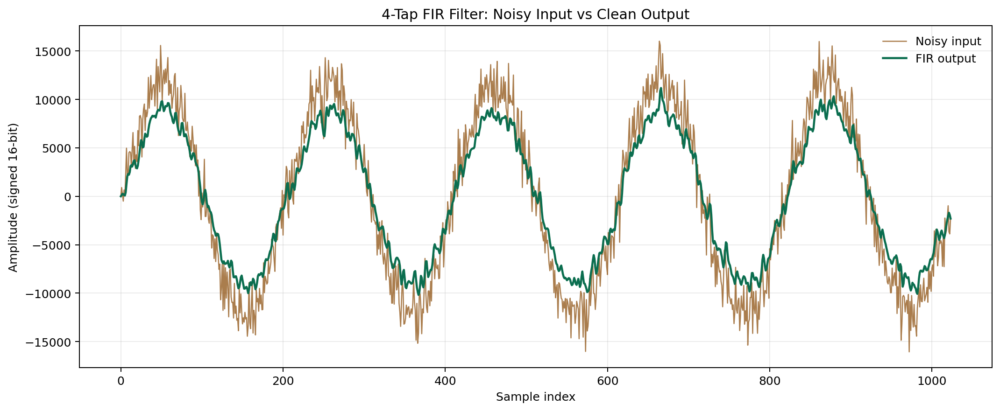
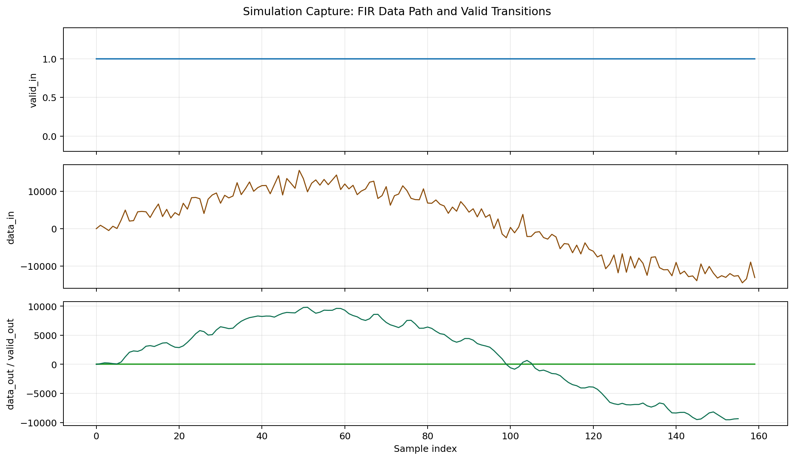
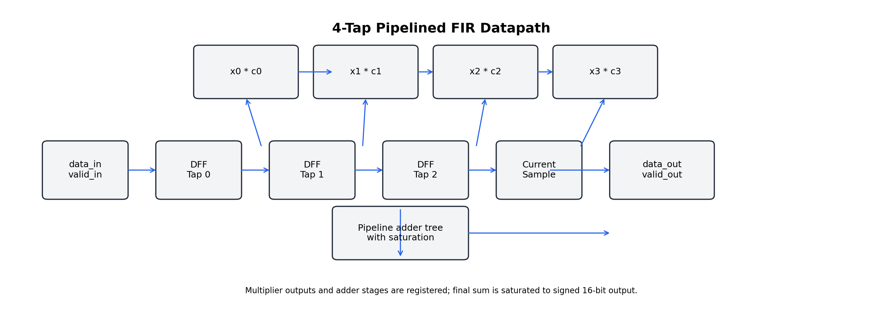

# 4-Tap Pipelined FIR Filter

This repository contains a compact SystemVerilog FIR filter that is written and documented like a small DSP hardware block rather than a student assignment. The design uses a pipelined direct-form architecture, signed 16-bit fixed-point arithmetic, and saturation on the final accumulated result.

## What This Project Does

The filter accepts a signed 16-bit input sample stream, shifts the history through three delay registers, multiplies the four taps by hardcoded Q15 coefficients, and emits a saturated signed 16-bit output. A Python reference model produces a noisy sine wave and the matching golden output so the RTL can be checked against known-good data.

## Why This Architecture

The pipelined structure reduces the critical path by registering multiplier outputs before the adder tree. That makes the implementation more representative of a practical DSP accelerator block than a purely combinational example. Saturation is included so overflow behavior is deterministic and easier to review in hardware sign-off.

## Repository Contents

- [rtl/fir_filter.sv](rtl/fir_filter.sv): synthesizable 4-tap FIR RTL
- [rtl/dff.sv](rtl/dff.sv): reusable register primitive placeholder
- [scripts/generate_samples.py](scripts/generate_samples.py): golden-reference input/output generator
- [scripts/generate_assets.py](scripts/generate_assets.py): reproducible asset generator
- [tb/fir_filter_tb.sv](tb/fir_filter_tb.sv): self-checking simulation testbench
- [assets/fir_signal_plot.png](assets/fir_signal_plot.png): noisy input vs filtered output plot
- [assets/fir_waveform_capture.png](assets/fir_waveform_capture.png): waveform-style transition capture
- [assets/fir_block_diagram.png](assets/fir_block_diagram.png): datapath block diagram

## Visual Proof Of Operation

The figures below provide presentation-ready proof of the design behavior.







## Reproducibility

The exact flow used to regenerate the sample files, simulation output, and documentation assets is:

```bash
python3 scripts/generate_samples.py
iverilog -g2012 -o sim/fir_filter_tb.vvp rtl/fir_filter.sv tb/fir_filter_tb.sv
vvp sim/fir_filter_tb.vvp
python3 scripts/generate_assets.py
```

Expected artifacts:

- `sim/fir_input.txt`: noisy signed sample stream
- `sim/fir_output.txt`: Python golden-reference output
- `sim/fir_hw_output.txt`: hardware output captured by the testbench
- `sim/fir_filter.vcd`: waveform dump for GTKWave review

## Interface

The top-level RTL module is `fir_filter` with the required interface:

- `clk`
- `rst_n`
- `valid_in`
- `data_in[15:0]`
- `valid_out`
- `data_out[15:0]`

## Fixed Coefficients

The filter uses four hardcoded signed Q15 coefficients:

- `4096`
- `8192`
- `8192`
- `4096`

These correspond to a simple low-pass response that is easy to verify in simulation.

## Notes

This workspace currently contains the FIR filter project only. If you add the CPU project later, the same documentation pattern can be reused for its pipeline screenshot and block diagram assets.
